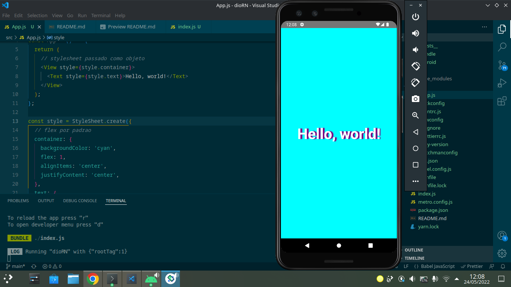

# Hello World -- React Native

## Descrição

Este aplicativo foi desenvolvido como parte de meus estudos à introdução ao desenvolvimento nativo utilizando o React Native. O Yarn foi utilizada como gerenciador de pacotes na hora da build ser realizada. O Android Studio foi utilizado para realizar a emulação de um aparelho celular (Pixel 3, Android S).

## Como rodar

Para rodar o aplicativo no momento é necessário clonar este repositório e possuir o Android Studio, juntamente com suas dependências (OpenJDK, Node, Android SDK). É necessário executar o Metro para possibilitar o reload do ambiente de desenvolvimento, isso é feito através do comando `npx react-native start` através do terminal com o diretório sendo a pasta deste projeto. Após isso deve ser rodado o comando `npx react-native run-android` caso o metro esteja em um terminal exclusivo.

## Links úteis

[Documentação do React Native](https://reactnative.dev/docs/getting-started)
